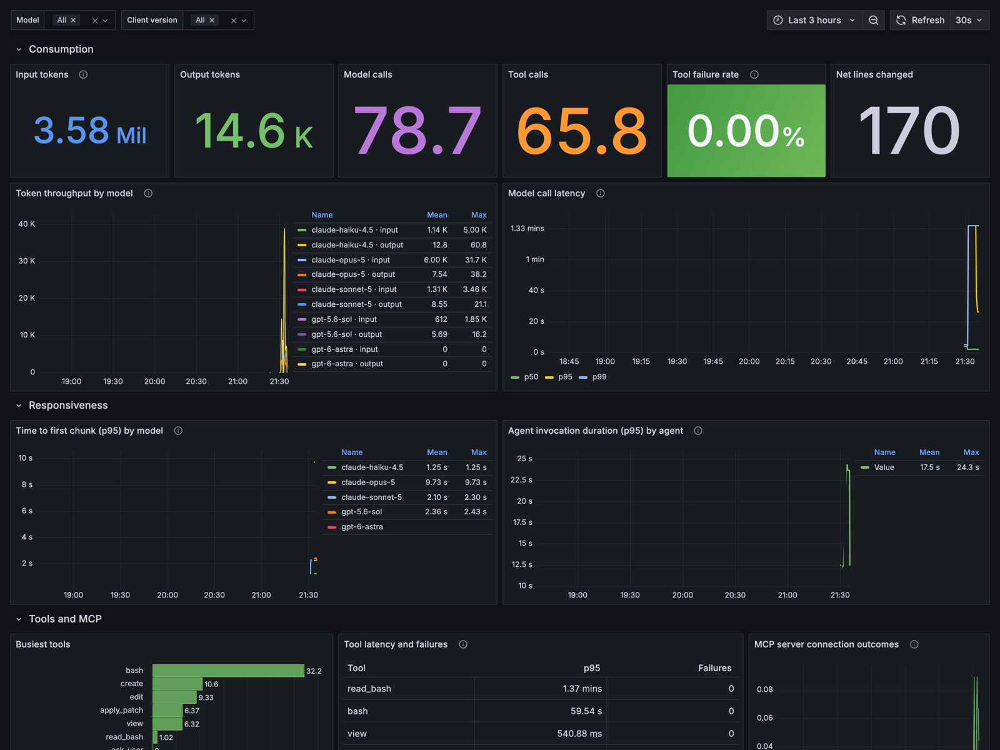
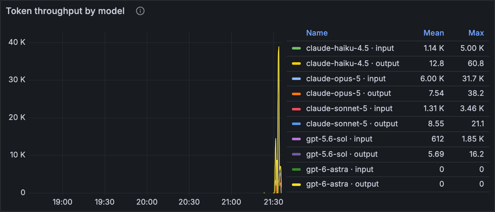
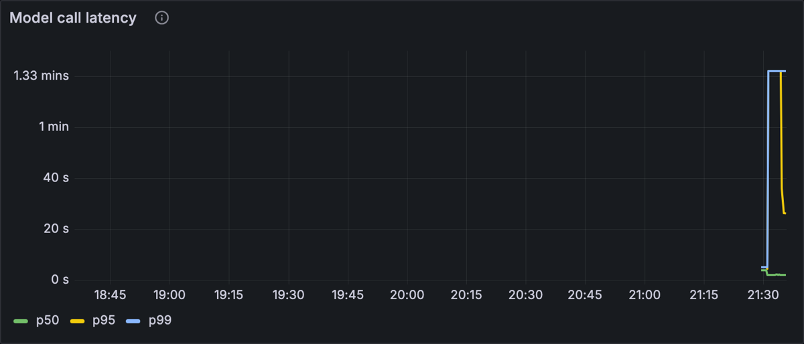
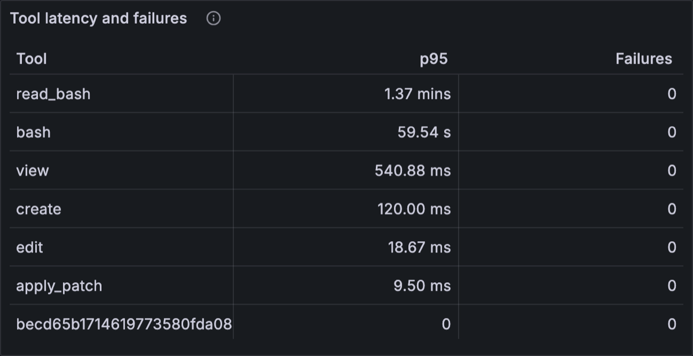
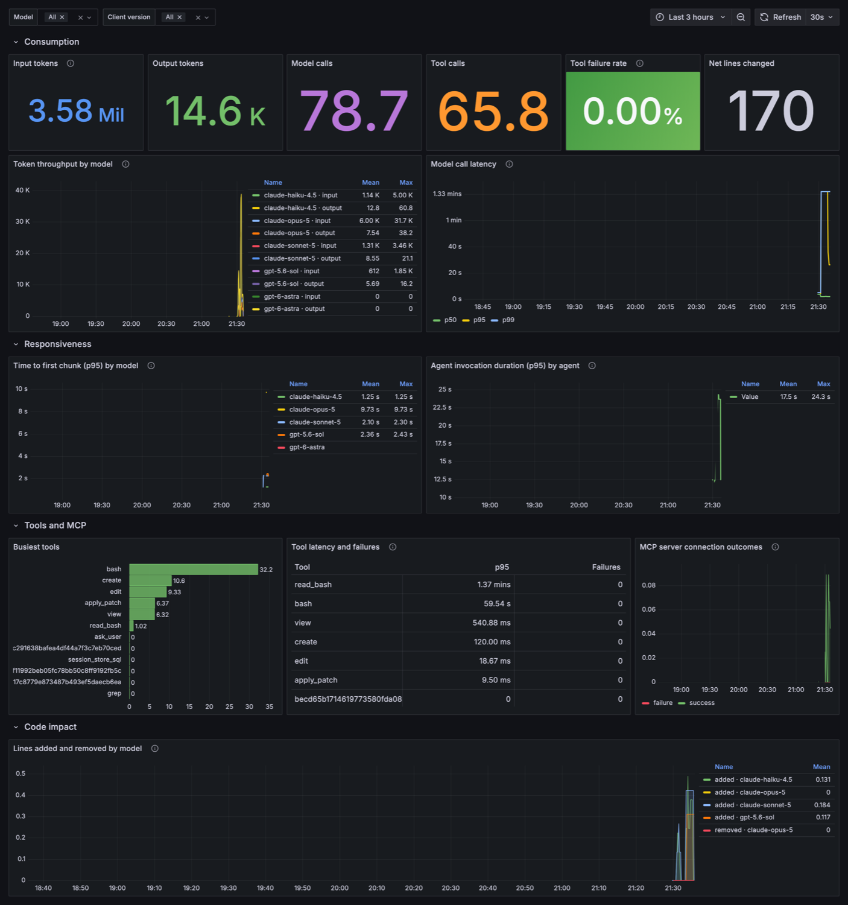

# Copilot OpenTelemetry dashboard

Point Copilot at a collector, get a Grafana dashboard showing token spend, model latency, tool behaviour, and how much code the agent is actually writing.



*Real data from a live run: Copilot app sessions and CLI runs across four models. Every number here came out of an actual collector, not a mockup.*

https://github.com/user-attachments/assets/c56ac4c5-f066-4558-aaed-abd31beaa1d8

## Run it

```bash
docker compose up -d
```

Then turn on telemetry for your Copilot clients:

```bash
cd ../enterprise-managed-settings/deploy
./install-macos.sh ../scenarios/07-otel-telemetry.json
```

Restart the Copilot app and use it for a few minutes. Open <http://localhost:3000>, which is anonymous-admin so there is no login to get past. The dashboard is under the **GitHub Copilot** folder.

Ports: Grafana on 3000, Prometheus on 9090, Tempo on 3200, and the collector's OTLP endpoint on 4319.

To confirm data is arriving before you go looking at panels:

```bash
docker compose logs -f collector
```

## Run it without Docker

```bash
cd local
./run-stack.sh          # downloads and starts everything
./run-stack.sh stop
```

Grafana, Prometheus, Tempo, and the collector all ship standalone binaries, so a laptop with no container runtime runs the same stack on the same ports. The script reuses the committed configs and only rewrites the Compose hostnames to loopback. This is how the screenshots above were captured.

If you only want to see what a client emits, skip the stack entirely:

```bash
cd local
./run-tap.sh
```

That starts just a collector on `127.0.0.1:4319` and writes every signal to `captured/*.jsonl`. No Grafana, no Prometheus, just the raw truth. It is the fastest way to prove a managed `telemetry` setting is reaching a client, and the right tool when a panel is empty and you need to know whether the data ever arrived.

```bash
node summarize-capture.mjs
```

prints every span name, every metric, and every label present in a capture. A redacted example is in `local/sample-capture/`.

For a single CLI run you do not need managed settings at all:

```bash
OTEL_EXPORTER_OTLP_ENDPOINT=http://127.0.0.1:4319 copilot -p "hello"
```

## What the dashboard shows

Four rows, ordered by the question you are most likely to be asking.

**Consumption.** Input and output tokens, model calls, tool calls, tool failure rate, net lines changed. Token throughput is stacked by model and token type, so a model with heavy cache reads looks visibly different from one without.



**Responsiveness.** Time to first chunk at p95 broken out by model, which is the latency users actually perceive, alongside end-to-end agent invocation duration. Those two diverging usually means tool execution rather than the model.



**Tools and MCP.** Busiest tools, a table pairing p95 duration with failure count, and MCP connection outcomes over time. A rising MCP failure line is much more often a managed allowlist or a credential problem than a flaky server.



**Code impact.** Lines added and removed by model, recorded live by the editing tools rather than inferred from commits.

Two template variables filter everything: model, and client version. Client version is useful during a rollout.

<details>
<summary>Full dashboard, all four rows</summary>



</details>

## Reproducing the screenshots

The stack runs fine without Docker, which is how the media above was captured: Grafana, Prometheus, Tempo, and the collector all ship standalone binaries. `local/capture-dashboard.mjs` then drives Chromium through Playwright to take the screenshots and record the walkthrough.

```bash
node local/capture-dashboard.mjs ./media
```

It waits on Grafana's own panel-ready signal rather than sleeping, so it does not race the queries.

## The metric names are real

Every query in the dashboard uses metric and label names taken from a live capture, then confirmed by running them through the collector's Prometheus exporter and reading the output. Copilot's OTel names go through two translations on the way to a PromQL query, and guessing either one wrong gives you an empty panel that looks like a data problem.

| OTel instrument | Prometheus series |
| --- | --- |
| `gen_ai.client.token.usage` | `gen_ai_client_token_usage_{sum,count,bucket}` |
| `gen_ai.client.operation.duration` | `gen_ai_client_operation_duration_seconds_*` |
| `gen_ai.client.operation.time_to_first_chunk` | `gen_ai_client_operation_time_to_first_chunk_seconds_*` |
| `gen_ai.invoke_agent.duration` | `gen_ai_invoke_agent_duration_seconds_*` |
| `github.copilot.tool.call.count` | `github_copilot_tool_call_count_total` |
| `github.copilot.tool.call.duration` | `github_copilot_tool_call_duration_seconds_*` |
| `github.copilot.code.lines_added` | `github_copilot_code_lines_added_total` |
| `github.copilot.mcp.server.connection.count` | `github_copilot_mcp_server_connection_count_total` |

Note what happens to units. A real unit like `s` becomes a `_seconds` suffix. An annotation-only unit like `{token}` or `{call}` disappears, except that counters still pick up `_total`. Labels get dots swapped for underscores, so `gen_ai.request.model` is queried as `gen_ai_request_model`.

Resource attributes only become labels because the exporter sets `resource_to_telemetry_conversion`. That is what supplies `service_version` for the client-version filter, and it is also why the config has to drop `agency.session_id` before it reaches Prometheus. See [Cost and cardinality](#cost-and-cardinality).

One documented attribute does not exist: the reference names `gen_ai.usage.cache_creation.input_tokens`, but the runtime emits `gen_ai.usage.cache_write.input_tokens`. See [VALIDATION.md](../enterprise-managed-settings/VALIDATION.md#documentation-discrepancies).

## Sending it somewhere other than Grafana

The collector is the seam. Swap the exporter and the rest is unchanged.

**Honeycomb**

```yaml
exporters:
  otlp/honeycomb:
    endpoint: api.honeycomb.io:443
    headers:
      x-honeycomb-team: ${env:HONEYCOMB_API_KEY}
```

**Datadog**

```yaml
exporters:
  datadog:
    api:
      key: ${env:DD_API_KEY}
      site: datadoghq.com
```

**Grafana Cloud**

```yaml
exporters:
  otlphttp/grafanacloud:
    endpoint: https://otlp-gateway-<region>.grafana.net/otlp
    auth:
      authenticator: basicauth/grafanacloud
```

**Azure Monitor**

```yaml
exporters:
  azuremonitor:
    connection_string: ${env:APPLICATIONINSIGHTS_CONNECTION_STRING}
```

You can also skip the collector entirely and point `telemetry.endpoint` at any OTLP-native backend, adding credentials through the `headers` object in managed settings. The collector earns its place when you want to fan out to more than one backend, drop the noisy `session.timing.*` spans, or scrub content before it leaves the building.

## Content capture

`captureContent` is off by default and should usually stay there. Turning it on adds prompts, model responses, tool arguments, and tool results to spans, which means source code and whatever a developer typed end up in your observability backend.

If you do need it, set `lockCaptureContent: true` so developers cannot toggle it locally, and uncomment the `redaction` processor in `otel-collector-config.yaml` as a second line of defence.

## Cost and cardinality

Two things will bite you at scale, and both are handled in the shipped config.

**Session ID as a metric label.** The Prometheus exporter runs with `resource_to_telemetry_conversion` enabled, which is what makes `service.version` available for the client-version filter. It also promotes `agency.session_id`, a fresh UUID per Copilot session, which means every session mints a brand new time series for every metric. Measured on a single laptop: seven sessions produced 529 series, and three captured batches produced 1,538 series without the guard versus 1,167 with it. Left alone, that grows without bound.

The metrics pipeline therefore drops the attribute:

```yaml
processors:
  resource/metrics_cardinality:
    attributes:
      - key: agency.session_id
        action: delete
```

Traces keep it. Correlating spans back to a session is exactly what it is for, and high cardinality is normal and cheap in a trace store. If you need per-session *metrics*, derive them from traces in Tempo rather than turning this off.

**Span volume.** A busy developer produces a lot of spans, and most are not interesting. The `session.timing.*` family alone was over half the spans in my capture. If you pay per span, drop them at the collector:

```yaml
processors:
  filter/drop_timing:
    error_mode: ignore
    traces:
      span:
        - 'name matches "^session\\.timing\\."'
```

Then add `filter/drop_timing` to the traces pipeline ahead of `batch`.

## Files

| File | Purpose |
| --- | --- |
| `docker-compose.yml` | Collector, Prometheus, Tempo, Grafana |
| `otel-collector-config.yaml` | Receiver, processors, fan-out to Prometheus and Tempo |
| `prometheus.yml` | Scrape config |
| `tempo.yaml` | Single-binary Tempo with local storage |
| `grafana/dashboards/copilot-agent-overview.json` | The dashboard |
| `grafana/provisioning/` | Datasource and dashboard provisioning |
| `local/run-stack.sh` | Whole stack, standalone binaries, no Docker |
| `local/run-tap.sh` | Collector only, for seeing raw signals |
| `local/capture-dashboard.mjs` | Screenshots and video via Playwright |
| `local/summarize-capture.mjs` | Summarize a capture |
| `local/sample-capture/` | Redacted example of what Copilot sends |
| `media/` | Screenshots and walkthrough used in this README |

## Reference

* [OpenTelemetry for agent monitoring](https://docs.github.com/copilot/concepts/enterprise/opentelemetry)
* [Copilot CLI OTel reference](https://docs.github.com/copilot/reference/copilot-cli-reference/cli-command-reference#opentelemetry-monitoring)
* [OTel GenAI semantic conventions](https://github.com/open-telemetry/semantic-conventions-genai)
